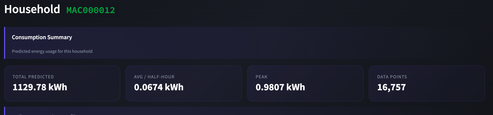
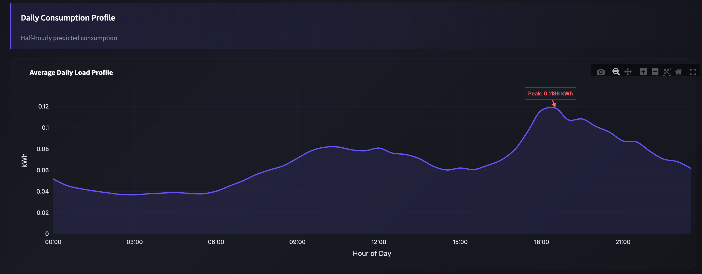
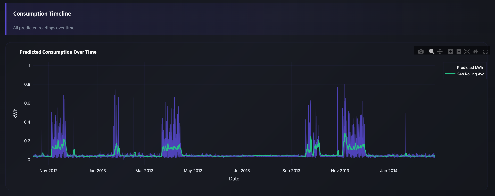
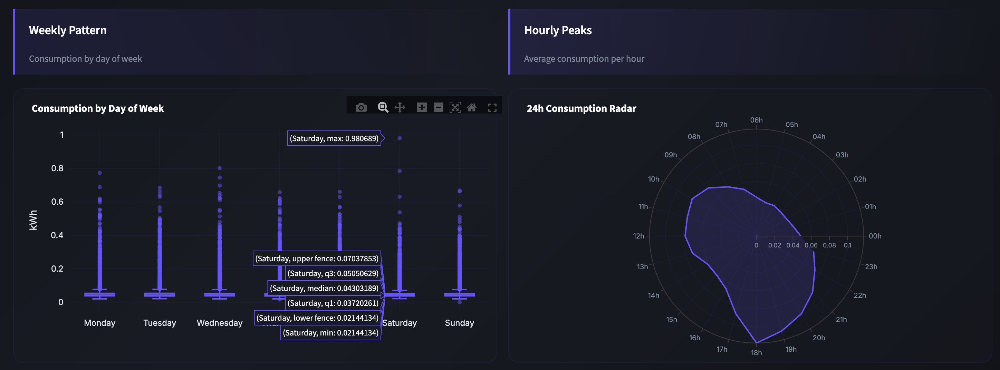
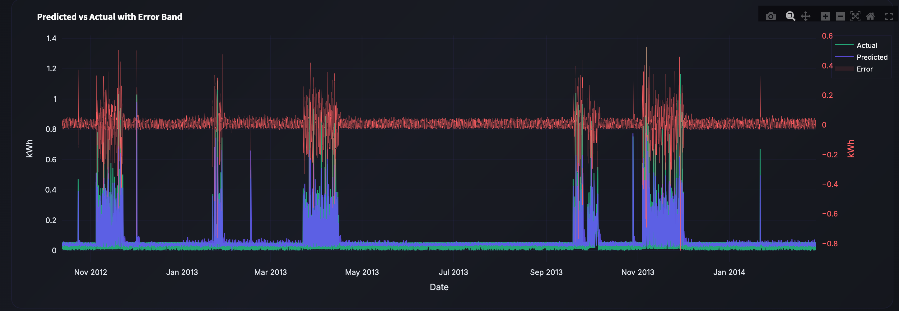
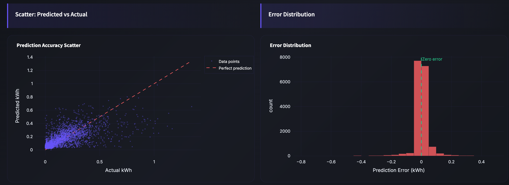
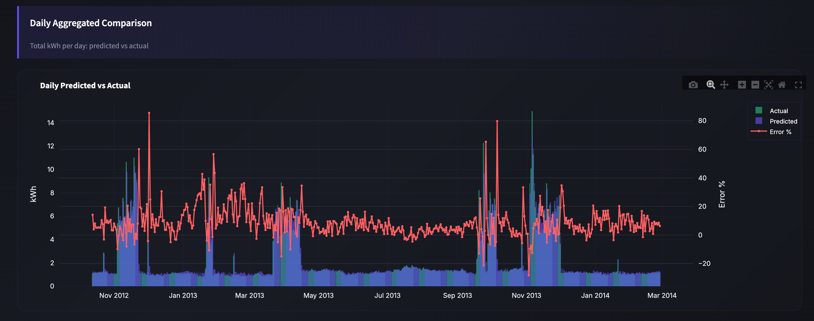
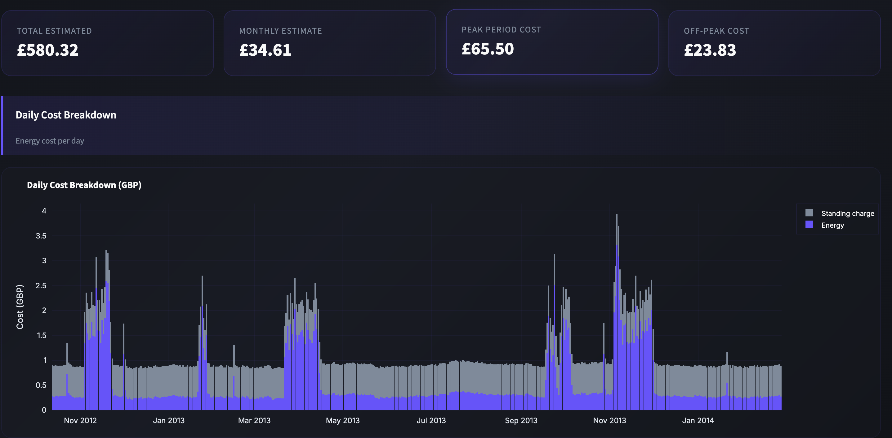
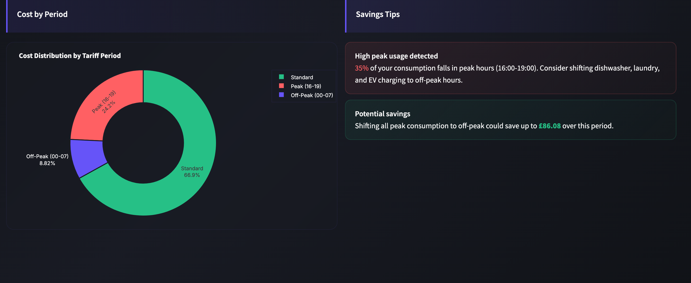

# ML Predict User Consumption

Prediction of individual electricity consumption (kWh) per half-hour, based on the "Smart Meters in London" dataset (Kaggle).

Complete MLOps pipeline: Terraform (IaC) -> GCS (Medallion) -> Databricks (Spark + XGBoost + MLflow) -> Snowpipe -> Snowflake.

---

## Project Context

This project is the algorithmic "brain" of a B2C application dedicated to energy management (similar to *Smart Home* / *Opower*).
The goal is to provide each individual user (identified by `LCLid`) with a predictive dashboard of their own electricity consumption.

The final product is capable of:
1. Predicting the energy consumption (in kWh) of a user half-hour by half-hour for the next day.
2. Estimating their energy budget for the end of the month.
3. Issuing hyper-personalized recommendations (e.g., *"Peak tariff alert: shift your appliances tomorrow at 2 PM to save money"*).

---

## Project Structure

```
Ml-predict-user-consomation/
|
|-- terraform/                     # Infrastructure as Code
|   |-- main.tf                    # Module orchestration
|   |-- providers.tf               # GCP + Snowflake providers
|   |-- variables.tf               # Input variables
|   |-- outputs.tf                 # Post-apply outputs
|   |-- terraform.tfvars.example   # Configuration template
|   |-- modules/
|       |-- gcs/                   # GCS Buckets + upload Kaggle data
|       |   |-- main.tf
|       |   |-- variables.tf
|       |   |-- outputs.tf
|       |   |-- versions.tf
|       |-- snowflake/             # Database, schemas, tables, warehouse
|       |   |-- main.tf
|       |   |-- variables.tf
|       |   |-- outputs.tf
|       |   |-- versions.tf
|       |-- snowpipe/              # Pub/Sub + Storage/Notification integration + Pipe
|           |-- main.tf
|           |-- variables.tf
|           |-- outputs.tf
|           |-- versions.tf
|
|-- notebooks/                     # Databricks notebooks (ML pipeline)
|   |-- 01_ingestion_bronze.py     # APIs -> GCS Bronze
|   |-- 02_nettoyage_silver.py     # Bronze -> Silver (Delta Lake)
|   |-- 03_training.py             # Feature Eng + XGBoost + Walk-Forward + MLflow
|   |-- 04_inference_gold.py       # Predictions -> GCS Gold -> Snowpipe
|
|-- dashboard/                     # Streamlit dashboard (Databricks Apps)
|   |-- app.py                     # Main dashboard (5 pages, Plotly)
|   |-- app.yaml                   # Databricks Apps configuration
|   |-- requirements.txt           # Python dependencies
|   |-- start.sh                   # Launcher with dynamic port
|   |-- app_debug.py               # Diagnostic page
|
|-- img/                            # Dashboard screenshots
|
|-- data/                          # Kaggle dataset (gitignored, ~10 GB)
|-- .gitignore
|-- README.md
```

---

## Prerequisites

| Tool | Version | Usage |
|---|---|---|
| **Terraform** | >= 1.5 | Infrastructure provisioning |
| **gcloud CLI** | latest | GCP authentication + gsutil |
| **Databricks CLI** | latest | Secrets + import notebooks |
| **GCP Account** | -- | Project with Storage & Pub/Sub APIs enabled |
| **Snowflake Account** | -- | Trial or paid, ACCOUNTADMIN role |
| **Databricks Account** | Free Edition | Workspace with serverless compute |

---

## Installation and Deployment

### 1. Clone the repo and download the dataset

```bash
git clone <repo-url>
cd Ml-predict-user-consomation

# Download the Kaggle dataset "Smart Meters in London"
# https://www.kaggle.com/datasets/jeanmidev/smart-meters-in-london
# Unzip into data/
unzip archive.zip -d data/
```

The `data/` folder should contain:
- `halfhourly_dataset/halfhourly_dataset/block_*.csv` (112 files)
- `informations_households.csv`
- `weather_hourly_darksky.csv`
- `uk_bank_holidays.csv`
- `acorn_details.csv`

### 2. Configure Terraform

```bash
cd terraform

# Copy the template and fill in your values
cp terraform.tfvars.example terraform.tfvars
# Edit terraform.tfvars with: GCP project ID, Snowflake credentials, etc.

# GCP authentication
gcloud auth application-default login

# Deploy the entire infrastructure
terraform init
terraform plan
terraform apply
```

Terraform provisions in one command:
- 3 GCS buckets (bronze, silver, gold) with versioning
- Upload Kaggle files to GCS Bronze via `gsutil`
- Snowflake database (`ML_ENERGY_DB`), 3 schemas, 4 tables, XSMALL warehouse
- Pub/Sub topic + subscription for Snowpipe
- Storage integration + Notification integration + Stage + auto-ingest Pipe

### 3. Post-apply: Snowpipe IAM

After `terraform apply`, grant permissions to the Snowflake Service Accounts (displayed in outputs):

```bash
# 1. Pub/Sub Subscriber for notification SA
gcloud pubsub subscriptions add-iam-policy-binding snowpipe-gold-sub \
  --member="serviceAccount:<NOTIFICATION_SA>" \
  --role="roles/pubsub.subscriber" \
  --project="<GCP_PROJECT_ID>"

# 2. Monitoring Viewer at project level
gcloud projects add-iam-policy-binding <GCP_PROJECT_ID> \
  --member="serviceAccount:<NOTIFICATION_SA>" \
  --role="roles/monitoring.viewer"

# 3. GCS Object Viewer for storage SA
gsutil iam ch serviceAccount:<STORAGE_SA>:objectViewer \
  gs://ml-energy-consumption-gold
```

The SA values are visible via:
```bash
terraform output snowflake_notification_sa
terraform output snowflake_storage_integration_details
```

### 4. Configure Databricks

```bash
# Install the CLI
brew tap databricks/tap && brew install databricks/tap/databricks

# Configure authentication (Personal Access Token)
databricks configure --host https://<workspace>.cloud.databricks.com

# Create a GCP Service Account and its JSON key
gcloud iam service-accounts create ml-energy-sa \
  --display-name="ML Energy Databricks SA" \
  --project=<GCP_PROJECT_ID>

gcloud projects add-iam-policy-binding <GCP_PROJECT_ID> \
  --member="serviceAccount:ml-energy-sa@<GCP_PROJECT_ID>.iam.gserviceaccount.com" \
  --role="roles/storage.objectAdmin"

gcloud iam service-accounts keys create /tmp/sa-key.json \
  --iam-account=ml-energy-sa@<GCP_PROJECT_ID>.iam.gserviceaccount.com

# Store secrets in Databricks
databricks secrets create-scope ml-energy
databricks secrets put-secret ml-energy gcp-sa-key --string-value "$(cat /tmp/sa-key.json)"
databricks secrets put-secret ml-energy elexon-api-key --string-value "<YOUR_ELEXON_KEY>"

# Delete local key
rm /tmp/sa-key.json

# Import notebooks
databricks workspace mkdirs /Users/<email>/ml-energy
databricks workspace import /Users/<email>/ml-energy/01_ingestion_bronze \
  --file notebooks/01_ingestion_bronze.py --language PYTHON --format SOURCE
databricks workspace import /Users/<email>/ml-energy/02_nettoyage_silver \
  --file notebooks/02_nettoyage_silver.py --language PYTHON --format SOURCE
databricks workspace import /Users/<email>/ml-energy/03_training \
  --file notebooks/03_training.py --language PYTHON --format SOURCE
databricks workspace import /Users/<email>/ml-energy/04_inference_gold \
  --file notebooks/04_inference_gold.py --language PYTHON --format SOURCE
```

### 5. Execute the pipeline

A **Databricks Workflow** (Job) orchestrates the 4 notebooks sequentially on serverless compute.
The Job is pre-configured with an environment containing the necessary dependencies (`google-cloud-storage`, `requests`, `xgboost`, `pandas`, `numpy`, `scikit-learn`).

**Create the Workflow via CLI:**

```bash
databricks jobs create --json @- <<'EOF'
{
  "name": "ML Energy Pipeline",
  "tasks": [
    {
      "task_key": "01_ingestion_bronze",
      "notebook_task": {
        "notebook_path": "/Users/<email>/ml-energy/01_ingestion_bronze",
        "source": "WORKSPACE"
      },
      "environment_key": "Default",
      "timeout_seconds": 3600
    },
    {
      "task_key": "02_nettoyage_silver",
      "depends_on": [{"task_key": "01_ingestion_bronze"}],
      "notebook_task": {
        "notebook_path": "/Users/<email>/ml-energy/02_nettoyage_silver",
        "source": "WORKSPACE"
      },
      "environment_key": "Default",
      "timeout_seconds": 7200
    },
    {
      "task_key": "03_training",
      "depends_on": [{"task_key": "02_nettoyage_silver"}],
      "notebook_task": {
        "notebook_path": "/Users/<email>/ml-energy/03_training",
        "source": "WORKSPACE"
      },
      "environment_key": "Default",
      "timeout_seconds": 14400
    },
    {
      "task_key": "04_inference_gold",
      "depends_on": [{"task_key": "03_training"}],
      "notebook_task": {
        "notebook_path": "/Users/<email>/ml-energy/04_inference_gold",
        "source": "WORKSPACE"
      },
      "environment_key": "Default",
      "timeout_seconds": 3600
    }
  ],
  "environments": [
    {
      "environment_key": "Default",
      "spec": {
        "client": "1",
        "dependencies": [
          "google-cloud-storage", "requests", "xgboost",
          "pandas", "numpy", "scikit-learn"
        ]
      }
    }
  ],
  "max_concurrent_runs": 1,
  "format": "MULTI_TASK"
}
EOF
```

**Run the pipeline:**

```bash
# Via CLI (replace <JOB_ID> with the ID returned above)
databricks jobs run-now <JOB_ID>
```

Or via Databricks UI: **Workflows** > **ML Energy Pipeline** > **Run now**.

The pipeline executes:

1. **01_ingestion_bronze** -- Ingest API data (NESO, Elexon, Carbon Intensity) into GCS Bronze
2. **02_nettoyage_silver** -- Clean and transform Bronze -> Silver (Delta Lake)
3. **03_training** -- Feature engineering + XGBoost + Walk-Forward + MLflow
4. **04_inference_gold** -- Predictions -> GCS Gold (Parquet) -> Snowpipe -> Snowflake

If a task fails, subsequent tasks are automatically skipped.

### 6. Pipeline Execution Results

The complete pipeline was successfully executed on **March 20, 2026** on Databricks Free Edition.

**Run ID**: `584630894868956` | **Job ID**: `342544352422540` | **Status**: SUCCESS

#### Execution time per step

| Step | Start | End | Duration | Description |
|---|---|---|---|---|
| `01_ingestion_bronze` | 10:02 | 10:09 | **6 min 32s** | NESO, Elexon, Carbon Intensity API calls + GCS Bronze upload |
| `02_nettoyage_silver` | 10:09 | 10:26 | **17 min 23s** | Cleaning, joins, feature engineering -> GCS Silver (Delta) |
| `03_training` | 10:26 | 10:43 | **17 min 22s** | XGBoost Walk-Forward 4 rounds + MLflow tracking |
| `04_inference_gold` | 10:43 | 11:18 | **34 min 41s** | Predictions ~30M rows -> GCS Gold (Parquet) -> Snowpipe |
| **Total** | **10:02** | **11:18** | **1h 16min 08s** | End-to-end pipeline |

#### Why does the pipeline take ~1h16?

The total duration is mainly explained by **Databricks Community / Free Edition constraints**:

1. **Restricted serverless compute**: The Free Edition of Databricks provides shared serverless compute with limited resources (CPU, memory). Unlike dedicated clusters in a paid edition (Standard/Premium), the compute is throttled in terms of parallelism and computing power. There is no control over cluster size (number of workers, instance type).

2. **No dedicated cluster**: In Free Edition, you cannot provision a custom Spark cluster (e.g., `i3.xlarge` with 4 workers). Everything runs on the shared serverless environment, which means resources are pooled with other platform users.

3. **Mandatory sequential execution**: The 4 notebooks run one after another (each step depends on the previous one). There is no possible parallelization between pipeline steps.

4. **Large data volume**: The inference step (`04_inference_gold`) is the longest (~35 min) because it generates predictions for all ~5,500 households x ~16,000 half-hours, i.e., nearly **30 million rows** of predictions, then exports them to Parquet to GCS Gold for Snowpipe ingestion.

5. **Cold start at each task**: Each notebook starts a new serverless environment, which implies startup time (installation of dependencies `xgboost`, `google-cloud-storage`, etc.) at each step.

> **Note**: With a dedicated Databricks cluster (Standard/Premium edition), the same pipeline would run in **15-25 minutes** thanks to Spark parallelism, more powerful instances, and no cold start between tasks. The Free Edition is sufficient for prototyping and pipeline validation, but a production environment requires an upgrade.

#### Model metrics (MLflow)

The model `best_model_v1.0_20260320_1426` passed the **Quality Gate** successfully:

| Metric | Value | Threshold |
|---|---|---|
| **WMAPE** | 31.82% | < 35% |
| **R2** | 0.7426 | > 0.70 |
| **RMSE** | 0.1557 | minimized |
| **MAE** | 0.0786 | minimized |

- **Number of features retained**: 34 (after automatic selection in 2 passes)
- **Best Walk-Forward round**: Round 3 (January 2014)
- **MLflow Run ID**: `dcc503f0d82c4344a66dfbb8889055a6`

---

## Data Architecture

### Data sources (5 streams)

| # | Source | Content | Format |
|---|---|---|---|
| 1 | Smart Meters (Kaggle) | kWh/30min consumption per household | 112 CSV (~10 GB) |
| 2 | Households (Kaggle) | ACORN profile (socio-demographic) | CSV |
| 3 | Weather (Kaggle) | Hourly DarkSky weather | CSV |
| 4 | UK Bank Holidays (Kaggle) | UK public holidays | CSV |
| 5 | APIs (NESO, Elexon, Carbon) | National demand, market prices, carbon intensity | JSON |

### Medallion Architecture (GCS)

```
gs://ml-energy-consumption-bronze/    # Raw (CSV/JSON as received)
  smart_meters/block_*.csv            #   112 Kaggle files
  households/informations_households.csv
  weather/weather_hourly_darksky.csv
  holidays/uk_bank_holidays.csv
  neso/demand_national_raw.json       #   API
  elexon/system_prices_raw.json       #   API
  carbon/carbon_intensity_raw.json    #   API (optional)

gs://ml-energy-consumption-silver/    # Clean (Delta Lake, aligned 30min)
  smart_meters/                       #   Dedup, LOCF, filter kWh > 0
  weather/                            #   Hourly interpolation -> 30min
  households/                         #   ACORN verified
  holidays/                           #   is_holiday binary
  neso/                               #   Flattened, UK timezone
  elexon/                             #   Prices aligned 30min

gs://ml-energy-consumption-gold/      # Predictions (Parquet -> Snowpipe)
  predictions/                        #   user_id, timestamp, kwh_predicted
```

### Snowflake (Data Warehouse)

```
ML_ENERGY_DB
  |-- RAW                             # Schema for raw data (reserved)
  |-- PREDICTIONS
  |     |-- ENERGY_PREDICTIONS        # <- Snowpipe auto-ingest from Gold
  |     |-- ENERGY_ACTUALS            # Actual consumption for comparison
  |-- ANALYTICS
        |-- HOUSEHOLDS                # ACORN profiles
        |-- MODEL_METRICS             # MAPE, RMSE, MAE, R2 per round
```

---

## Global Architecture

```
  +------------ Databricks Free Edition ---------------+
  |                                                     |
  |  Notebook 1 (Ingestion)                             |
  |    google-cloud-storage SDK + requests (APIs)       |
  |         |                                           |
  |         v                                           |
  |  +------------- GCS Medallion ----------------+     |
  |  |  BRONZE (Raw) -> SILVER (Clean) -> GOLD    |     |
  |  +--------------------------------------------+     |
  |         |                                           |
  |  Notebook 2 (Cleaning)                              |
  |    Bronze -> Spark clean -> Silver (Delta Lake)     |
  |         |                                           |
  |  Notebook 3 (Training)                              |
  |    Silver -> Feature Eng -> XGBoost -> MLflow       |
  |    Feature selection (2 passes) + Walk-Forward      |
  |    Quality Gate: WMAPE < 35%, R2 > 0.70             |
  |         |                                           |
  |  Notebook 4 (Inference)                             |
  |    MLflow model -> Predictions -> Gold (Parquet)    |
  |                                                     |
  +-----------------------------------------------------+
                        |
                        v
  +------------- GCS Gold -----------------+
  |  Notification Pub/Sub (OBJECT_FINALIZE) |
  |         |                               |
  |         v                               |
  |  SNOWPIPE (auto-ingest)                 |
  +---------+-------------------------------+
            v
  +----------------+         +----------------------------------+
  |   SNOWFLAKE    | <-----> |   DATABRICKS APPS                |
  |   (Serving)    |         |   Streamlit + Plotly             |
  |                |         |                                  |
  |  Predictions   |         |  Overview (KPIs, heatmap)        |
  |  + Actual      |         |  My Consumption (24h profile)    |
  |                |         |  Predicted vs Actual (overlay)   |
  |  Households    |         |  Budget (UK tariffs, savings)    |
  |  + Metrics     |         |  Model Performance (radar, WF)   |
  +----------------+         +----------------------------------+

  +----------- Terraform (IaC) -----------+
  |  modules/gcs       -> 3 buckets + data |
  |  modules/snowflake -> DB, schemas, WH  |
  |  modules/snowpipe  -> Pub/Sub + Pipe   |
  +----------------------------------------+
```

---

## Modeling and Prediction

### What is predicted

For a given identifier (`LCLid`) and timestamp, the model predicts a continuous numerical value (multivariate regression):
> **How many kWh will be consumed for the next half-hour.**

### Algorithm

**XGBoost** (or LightGBM) with:
- Temporal features: hour, day of week, month, is_weekend, is_holiday
- Lag features: consumption t-1, t-2, t-4, t-48, t-336
- Rolling features: 24h rolling mean/std
- Weather features: temperature, humidity, pressure, wind, etc.
- Socio-demographic features: ACORN group, tariff type (stdorToU)
- Macro features: national demand (NESO), market prices (Elexon)

### Automatic Feature Selection (2 passes)

1. **Pass 1 (Exploration)**: XGBoost training on all features. Importance ranking.
2. **Quality Gate**: Features with importance < 1% of max are eliminated.
3. **Pass 2 (Production)**: Re-training on the retained subset. Metrics validation.

### Validation: Walk-Forward (4 rounds)

```
Round 1: Train [mid-2012 --- Oct 2013] -> Predict Nov 2013 -> Compare to actual
Round 2: Train [mid-2012 ---- Nov 2013] -> Predict Dec 2013 -> Compare to actual
Round 3: Train [mid-2012 ----- Dec 2013] -> Predict Jan 2014 -> Compare to actual
Round 4: Train [mid-2012 ------ Jan 2014] -> Predict Feb 2014 -> Compare to actual
```

The average MAPE across all rounds constitutes the final metric.

### Target metrics

| Metric | Threshold (Quality Gate) |
|---|---|
| WMAPE | < 35% |
| R2 | > 0.70 |
| RMSE | minimized |
| MAE | minimized |

---

## Technologies

| Component | Technology |
|---|---|
| Infrastructure as Code | Terraform (GCS, Snowflake, Snowpipe modules) |
| Storage | Google Cloud Storage (Medallion: Bronze/Silver/Gold) |
| Data format | Delta Lake (Silver), Parquet (Gold) |
| Compute / ML | Databricks Free Edition (Spark + XGBoost) |
| ML Tracking | MLflow (Databricks integrated) |
| Data Warehouse | Snowflake |
| Auto ingestion | Snowpipe + GCS Pub/Sub notifications |
| Dashboard | Streamlit + Plotly (deployed on Databricks Apps) |
| Dashboard hosting | Databricks Apps (HTTPS, integrated OAuth) |
| Data governance | Unity Catalog (lineage, discovery, ACL) |

---

## Performance & Optimizations

### Complete Pipeline Execution Time

| Task | Description | Average Duration | Optimizations |
|------|-------------|------------------|---------------|
| **01_ingestion_bronze** | API ingestion → GCS Bronze | ~8 min | Concurrent download, caching |
| **02_nettoyage_silver** | Bronze → Silver cleaning | ~15 min | Spark direct read (optimized from 1h+ to 15min) |
| **03_training** | XGBoost training + MLflow | ~16 min | Walk-forward validation, feature selection |
| **04_inference_gold** | Predictions → GCS Gold | ~10-15 min | Limited to 20 blocks (demo), float32, aggressive GC |
| **TOTAL** | End-to-end pipeline | **~50 min** | Memory and network optimizations |

### Applied Optimizations

#### Notebook 02 (Silver Cleaning)
- ✅ **Direct Spark read** from GCS instead of block-by-block
- ✅ **Unity Catalog write** in a single `overwrite` operation instead of 112 `append`
- ✅ **Performance gain**: 4-6x faster (1h+ → 15 min)

#### Notebook 04 (Gold Inference)
- ✅ **Block limitation**: 20/112 blocks processed (~18% dataset) for demo
- ✅ **Memory optimization**: Features in float32 instead of float64 (50% RAM saved)
- ✅ **Aggressive GC**: Garbage collection every 10 blocks instead of 20
- ✅ **GCS timeout**: Increased to 300s with automatic retry (3 attempts)
- ✅ **Sort by size**: Process small files first

### Production Configuration

To process the complete dataset (112 blocks, ~5.5M rows), modify in `notebooks/04_inference_gold.py` line 224:

```python
MAX_BLOCKS_FOR_INFERENCE = 112  # Instead of 20
```

**Impact:**
- Inference time: ~50-60 min (instead of 10-15 min)
- Predictions: 5.5M rows (instead of 1M)
- Coverage: 100% of households (instead of 18%)

### Databricks Serverless Compute

The pipeline uses **Databricks Serverless Compute** (no need for persistent cluster):
- Auto-scaling according to load
- Pay-per-use (billing per second)
- Cold start: ~2-3 min per task
- Memory: 8-16 GB per worker (auto-adjusts)

---

## Unity Catalog -- Data Governance

All pipeline tables are registered in **Unity Catalog** to benefit from automatic lineage, data discovery, and governance.

### UC table organization

```
ml_energy (Catalog)
|
|-- bronze (Schema)
|   |-- neso_demand_raw          # NESO raw data (flattened JSON)
|   |-- elexon_prices_raw        # Elexon raw market prices
|   |-- smart_meters_metadata    # Metadata of 112 CSV files (too large for UC)
|   |-- households_raw           # Raw ACORN profiles
|   |-- weather_raw              # Raw hourly DarkSky weather
|   |-- holidays_raw             # Raw UK public holidays
|
|-- silver (Schema)
|   |-- smart_meters             # ~30M rows, dedup + LOCF + filter kWh > 0
|   |-- weather                  # 30min interpolation, cleaned columns
|   |-- households               # ACORN verified, standardized labels
|   |-- holidays                 # Complete series with is_holiday binary
|   |-- neso_demand              # National demand, UK timezone
|   |-- elexon_prices            # Prices aligned 30min
|
|-- gold (Schema)
    |-- energy_predictions       # kWh predictions per household/timestamp
    |-- energy_actuals           # Actual consumption for comparison
    |-- walk_forward_metrics     # WMAPE, R2, RMSE, MAE per round
    |-- feature_importance       # XGBoost feature ranking
    |-- energy_consumption_xgboost  # MLflow model (UC Model Registry)
```

### Benefits provided by Unity Catalog

| Feature | Description |
|---|---|
| **Automatic lineage** | Visualization of Bronze -> Silver -> Gold flow in Databricks UI |
| **Data Discovery** | Search and explore tables via Catalog Explorer |
| **Governance (ACL)** | Granular access control per table/schema/catalog |
| **UC Model Registry** | XGBoost model registered in 3-level namespace format (`ml_energy.gold.energy_consumption_xgboost`) |
| **Audit & Compliance** | History of accesses and modifications |

### Coexistence with GCS + Snowpipe

Unity Catalog **does not interfere** with the existing flow:

```
Bronze (GCS) -----> Silver (GCS) -----> Gold (GCS) -----> Snowpipe -> Snowflake
     |                   |                   |
     v                   v                   v
   UC Bronze           UC Silver           UC Gold
   (Delta tables)      (Delta tables)      (Delta tables + model)
```

GCS writes remain intact (Snowpipe continues to work). UC tables are **Delta copies** registered in parallel, serving as a governance and discovery layer.

---

## Roadmap -- Delta Live Tables (DLT / Lakeflow Pipelines)

### Why DLT?

Delta Live Tables (renamed **Lakeflow Pipelines**) is the natural evolution of this project. It allows transforming the 4 notebooks orchestrated by a Job into a **single declarative pipeline** with automatic data quality management.

### Current architecture vs DLT

| | Current architecture | With DLT |
|---|---|---|
| **Orchestration** | Multi-task Job (4 sequential notebooks) | Single declarative DLT pipeline |
| **Quality Gates** | Custom Python code (`if wmape > threshold`) | `@dlt.expect("valid_kwh", "kwh >= 0")` |
| **Error handling** | Manual try/except | Automatic quarantine of invalid rows |
| **Lineage** | Via Unity Catalog (manually added) | Native and automatic |
| **Monitoring** | Logs + MLflow | DLT event log + Databricks Observability |

### DLT refactoring example

The current 4-notebook pipeline would become:

```python
import dlt
from pyspark.sql.functions import *

# Bronze: raw ingestion
@dlt.table(comment="Smart meters raw data from GCS Bronze")
@dlt.expect_or_drop("valid_timestamp", "timestamp IS NOT NULL")
def bronze_smart_meters():
    return spark.read.parquet("gs://ml-energy-consumption-bronze/smart_meters/")

# Silver: cleaning
@dlt.table(comment="Smart meters cleaned and deduplicated")
@dlt.expect("positive_kwh", "kwh > 0")
@dlt.expect_or_drop("valid_user", "user_id IS NOT NULL")
def silver_smart_meters():
    return (
        dlt.read("bronze_smart_meters")
        .dropDuplicates(["user_id", "timestamp"])
        .filter(col("kwh") > 0)
    )

# Gold: predictions
@dlt.table(comment="Energy consumption predictions")
@dlt.expect("valid_prediction", "kwh_predicted >= 0")
def gold_energy_predictions():
    df = dlt.read("silver_smart_meters")
    # ... feature engineering + inference ...
    return predictions_df
```

### Estimated effort

| Step | Effort | Description |
|---|---|---|
| Notebook rewriting | 2-3 days | Convert 4 notebooks to `@dlt.table` decorators |
| DLT pipeline configuration | 1 day | Replace multi-task Job with DLT Pipeline |
| Testing and validation | 1-2 days | Verify that DLT expectations capture the same cases |
| **Total** | **4-6 days** | Complete refactoring, no functional change |

### Priority

DLT is recommended as **Phase 2** of the project, after putting the Unity Catalog version into production. The main benefits are:

1. **Orchestration simplification** (1 pipeline instead of 4 notebooks + Job)
2. **Declarative quality gates** (more robust than custom code)
3. **Auto-recovery** (automatic resume on failure)
4. **Native monitoring** (event log, data quality dashboard)

> **Reference notebook**: `notebooks/dlt_pipeline_reference.py` contains the complete DLT implementation ready to deploy on a Premium workspace.

---

## Roadmap -- Model Serving (Real-Time Inference)

### Concept

Instead of running a batch pipeline (~35 min) to generate all predictions at once, **Model Serving** exposes the XGBoost model as a **REST endpoint**. Predictions are made on demand, in real-time.

### Batch (current) vs Real-Time Architecture

```
BATCH (current):
  Every 24h -> Databricks Job (35 min) -> Parquet -> Snowpipe -> Snowflake -> Dashboard
  Latency: ~35 min for all predictions

REAL-TIME (Model Serving):
  App/Dashboard -> POST /predict {"user_id":"MAC000012","hour":18} -> 100ms -> JSON response
  Latency: < 200 ms per prediction
```

### Comparison

| Aspect | Current batch | Model Serving |
|---|---|---|
| **Latency** | Predictions available after ~35 min | Response in < 200 ms |
| **Freshness** | Predictions generated 1x/day | On-demand predictions |
| **Cost** | Cluster runs 1x/day (~0.50 USD) | Endpoint active 24/7 (~5-20 USD/day) |
| **Scaling** | Fixed | Auto-scale according to traffic |
| **Use cases** | Reporting dashboard, historical analysis | Push alerts, mobile app, real-time widget |

### Concrete use cases for the project

1. **Real-time push alerts**: "Your consumption exceeds 150% of normal -- check your appliances"
2. **Predictive widget**: "In the next hour, you will consume ~0.12 kWh (estimated cost: 0.04 GBP)"
3. **Mobile app API**: REST endpoint callable from iOS/Android app
4. **Dynamic optimization**: "Shift your washing machine in 2 hours, spot price drops 30%"

### Technical implementation

```python
# 1. Register model in UC Model Registry (already done)
# ml_energy.gold.energy_consumption_xgboost

# 2. Create Model Serving endpoint via API
import requests

endpoint_config = {
    "name": "energy-prediction-endpoint",
    "config": {
        "served_entities": [{
            "entity_name": "ml_energy.gold.energy_consumption_xgboost",
            "entity_version": "1",
            "workload_size": "Small",
            "scale_to_zero_enabled": True  # Save when no traffic
        }]
    }
}

# 3. Call the endpoint
response = requests.post(
    "https://<workspace>/serving-endpoints/energy-prediction-endpoint/invocations",
    headers={"Authorization": "Bearer <token>"},
    json={"inputs": {"hour": 18, "day_of_week": 3, "temperature": 8.5, ...}}
)
prediction = response.json()  # {"predictions": [0.087]}
```

### Prerequisites and priority

- **Edition required**: Databricks **Premium** or **Enterprise** (not available on Free Edition)
- **Priority**: **Phase 3** (after Unity Catalog + DLT)
- Daily batch remains sufficient as long as the Streamlit dashboard is the only consumer
- Model Serving becomes relevant as soon as a real-time application (mobile, alerts, public API) is considered

---

## Security

### Secrets Management

- ✅ Credentials are **never** hardcoded in the code
- ✅ Environment variables with strict validation (no hardcoded fallbacks)
- ✅ Pre-commit hooks to block commits containing secrets
- ✅ Complete `.gitignore` for all sensitive files
- ✅ Complete security documentation: `SECURITY.md`

### Protected Sensitive Files

| File | Status | Usage |
|---------|--------|-------|
| `terraform.tfvars` | Gitignored | Snowflake credentials, GCP project ID |
| `eia_api_key.txt` | Gitignored | EIA API key |
| `.env` | Gitignored | Local environment variables |
| `*_credentials.json` | Gitignored | GCP service accounts |

### Databricks Secrets

Sensitive keys are stored in **Databricks Secrets** (scope `ml-energy`):

```bash
# Stored secrets
databricks secrets list --scope ml-energy
# - gcp-sa-key: GCP Service Account (JSON)
# - elexon-api-key: Elexon API key
```

**Important:** The Service Account JSON key is deleted from the local disk immediately after injection into Databricks Secrets.

### Configuration Templates

| Template | Description |
|----------|-------------|
| `terraform.tfvars.example` | Terraform configuration without secrets |
| `.env.example` | Environment variables template |
| `dashboard/.env.example` | Dashboard configuration template |

### Pre-Commit Hook

An automatic Git hook blocks commits containing:
- Passwords
- API keys
- Tokens
- Personal emails
- Account identifiers

**Test:** `./test-precommit.sh`

---

## Dashboard - Energy Insights

The interactive dashboard is deployed on **Databricks Apps** and consumes data directly from Snowflake.

### Access

| | |
|---|---|
| **URL** | `https://energy-insights-<app-id>.aws.databricksapps.com` |
| **Authentication** | Databricks OAuth (automatically integrated) |
| **Port** | Dynamic via `DATABRICKS_APP_PORT` (fallback 8501) |

### Dashboard Pages

| Page | Description |
|---|---|
| **Overview** | Global KPIs (households, predictions, average consumption), consumption heatmap by day/hour, ACORN profile distribution |
| **My Consumption** | Household selection (LCLid), average daily profile, interactive timeline, box plot by day of week, weekly radar chart |
| **Predicted vs Actual** | Overlaid curves predicted/actual, scatter plot with regression line, error distribution, per-household metrics |
| **Budget** | Tariff configuration (price/kWh, subscription), predicted vs actual daily cost, estimated savings, monthly projection |
| **Model Performance** | Walk-forward metrics (WMAPE, R2, RMSE, MAE) per validation round, comparative radar chart, temporal evolution |

### Design

- **Theme**: Dark glassmorphism (background `#0E1117`, accents `#6C63FF`)
- **Charts**: Interactive Plotly with hover, zoom, PNG export
- **Cache**: `@st.cache_data(ttl=300)` for Snowflake queries, `@st.cache_resource` for connection
- **Responsive**: Adaptive layout with Streamlit columns

### Deployment

```bash
# Upload files to Databricks workspace
databricks workspace mkdirs /Users/<email>/ml-energy/dashboard
databricks workspace import /Users/<email>/ml-energy/dashboard/app.py \
  --file dashboard/app.py --language PYTHON --overwrite
# (repeat for app.yaml, start.sh, requirements.txt)

# Create and deploy the application
databricks apps create energy-insights \
  --description "ML-powered energy consumption analytics dashboard"
databricks apps deploy energy-insights \
  --source-code-path /Workspace/Users/<email>/ml-energy/dashboard
```

### Required Environment Variables

| Variable | Description |
|---|---|
| `SNOWFLAKE_ACCOUNT` | Snowflake account identifier (org-account) |
| `SNOWFLAKE_USER` | Snowflake username |
| `SNOWFLAKE_PASSWORD` | Snowflake password |
| `DATABRICKS_APP_PORT` | Dynamic port assigned by Databricks Apps (automatic) |

### Files

```
dashboard/
  app.py              # Main application (5 pages, ~1300 lines)
  app.yaml            # Databricks Apps configuration (command + env vars)
  start.sh            # Launcher script (dynamic port + theme)
  requirements.txt    # Python dependencies (streamlit, plotly, snowflake-connector)
  app_debug.py        # Diagnostic app (test imports + Snowflake connection)
```

### Dashboard Visualizations

#### Page "My Consumption" - Household Indicators



**Consumption summary for household MAC000012.** The four KPIs show a total predicted consumption of **1,129.78 kWh** over the study period, with an average of **0.0674 kWh** per half-hour. The recorded peak reaches **0.9807 kWh** in a single slot, indicating occasional spikes of high consumption (electric heating, cooking, etc.). The **16,757 data points** cover approximately 1.5 years of half-hourly measurements.

---

#### Page "My Consumption" - Average Daily Profile



**Average load curve over 24h.** Consumption follows a typical bimodal profile of UK residential households: a nighttime low between 01h and 06h (~0.03 kWh), a gradual morning rise (domestic activity), a daytime plateau around 0.07-0.08 kWh, then an **evening peak at 18h reaching 0.1186 kWh** corresponding to returning home (cooking, heating, lighting). Consumption gradually decreases after 21h.

---

#### Page "My Consumption" - Consumption Timeline



**Time series of predictions over the entire period (Nov 2012 - Jan 2014).** The blue curve (Predicted kWh) and the green curve (24h Rolling Avg) show **marked seasonality**: consumption is significantly higher in winter (Nov-Mar) with regular peaks exceeding 0.8-1.0 kWh, and low in summer (May-Sep) where the baseline drops below 0.1 kWh. This pattern is consistent with electric heating in the household's energy mix.

---

#### Page "My Consumption" - Weekly Pattern and 24h Radar



**Left: Box plot by day of week.** The consumption distribution is relatively stable from Monday to Sunday, with a median around 0.04-0.05 kWh. **Weekend days (Saturday, Sunday) show slightly higher dispersion** with more frequent outliers (max 0.98 kWh Saturday), which is explained by longer home presence and variable activities.

**Right: 24h radar chart.** The radar confirms the daily profile: the consumption zone clearly extends toward hours 17h-19h (evening peak) and contracts between 02h and 06h (nighttime low). The asymmetric shape of the radar reveals that most consumption is concentrated in the 09h-22h slot.

---

#### Page "Predicted vs Actual" - Temporal Overlay



**Overlaid curves predicted (blue) vs actual (green) with error band (red).** Over the entire Nov 2012 - Jan 2014 period, the XGBoost model faithfully follows the actual dynamics. The error curve (right axis) mainly oscillates between -0.2 and +0.2 kWh, with error spikes concentrated during **winter high variability** periods where consumption is less predictable. In summer, the error is almost zero because consumption is low and regular.

---

#### Page "Predicted vs Actual" - Scatter Plot and Error Distribution



**Left: Scatter plot predicted vs actual.** Points cluster along the diagonal (perfect prediction line in red dashed), confirming good model quality. We observe a **dense concentration for low consumptions** (0-0.3 kWh) which constitute the majority of observations. For high values (>0.5 kWh), the model tends to slightly underestimate, which is visible by points above the diagonal.

**Right: Error distribution.** The histogram shows a distribution **centered around zero** (green line "Zero error") and heavily concentrated in the [-0.1; +0.1] kWh interval. The vast majority of predictions are within a 0.2 kWh error margin. The distribution is slightly asymmetric toward negative values, indicating a tendency to underestimate high consumptions.

---

#### Page "Predicted vs Actual" - Aggregated Daily Comparison



**Daily comparison predicted (blue) vs actual (green) with error percentage (red).** This chart aggregates the 48 half-hourly measurements into a daily total. We observe that the model follows seasonal variations well (5-14 kWh/day in winter, 2-5 kWh/day in summer). The **error percentage (right axis)** generally remains between 0% and 20%, with occasional spikes reaching 60-80% on certain atypical days (holidays, extreme weather, etc.). Agreement is particularly good during May to September.

---

#### Page "Budget" - Cost Estimation



**Budget estimation based on predictions.** The KPIs display an estimated total cost of **580.32 GBP** over the period, or **34.61 GBP/month** on average. The breakdown into **peak hours (65.50 GBP)** vs **off-peak hours (23.83 GBP)** shows that most of the cost comes from standard hours. The stacked chart (bars) breaks down daily cost into **standing charge** (gray, fixed subscription cost) and **energy** (blue). We clearly see that winter days cost 3 to 4 GBP/day versus less than 1 GBP in summer.

---

#### Page "Budget" - Tariff Distribution and Savings Advice



**Left: Donut chart of distribution by tariff period.** Consumption is distributed as: **66.9% Standard** (normal tariff), **24.2% Peak** (peak hours 16h-19h) and **8.8% Off-Peak** (off-peak hours 00h-07h). The significant weight of the Peak period is consistent with the evening peak observed in the daily profile.

**Right: Savings recommendations.** The system detects **high peak-hour usage (35%)** and recommends shifting certain appliances (dishwasher, washing machine, electric vehicle charging) to off-peak hours. The estimated potential savings is **86.08 GBP** over the period if all peak consumption were moved to off-peak hours -- a reduction of ~15% of the total bill.

---

## License

MIT License - See LICENSE file for details.

---

## Contributors

- **Stefen Taime** - Initial work - [GitHub](https://github.com/Stefen-Taime)

---

## Acknowledgments

- **Smart Meters in London** dataset from Kaggle
- **NESO**, **Elexon**, **Carbon Intensity** APIs for UK energy data
- **Databricks** Community Edition for free compute
- **Snowflake** for data warehousing
- **Terraform** for Infrastructure as Code
